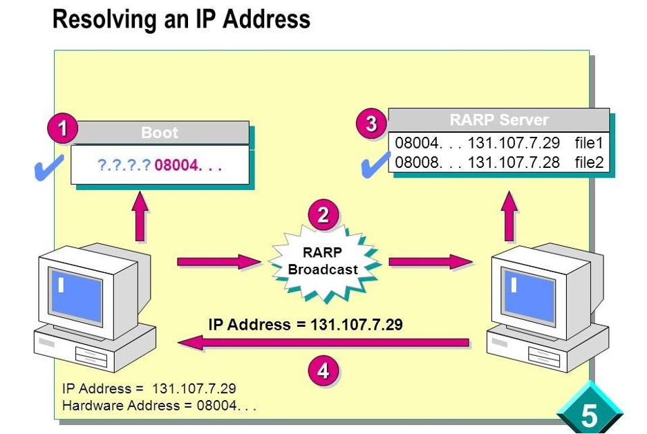

# протокол DHCP

IP-адрес назначается для нормальной работы сети каждому сетевому интерфейсу компьютера и маршрутизатора. 

Присоединение адресов происходит во время конфигурирования компьютеров и маршрутизаторов.

Ip-адрес назначается вручную при выполнении процедуры конфигурирования интерфейса, для компьютера сводящейся, например, к заполнению системы экранных форм.

При этом администратор понимает, какие адреса из имеющегося множества он уже использовал для других интерфейсов, а какие свободны.

При конфигурировании сообщается ряд других **конфигурационных параметров.**

При конфигурировании администратор должен назначить:

1. IP-адрес

2. TCP/IP

3. маску и IP-адрес маршрутизатора,

4. IP-адрес DNS-сервера,

5. доменное имя компьютера и т. п.

Протокол динамического конфигурирования хостов автоматизирует процесс конфигурирования сетевых интерфейсов.

Так же он гарантирует от дублирования адресов за счет централизованного управления их распределением.

# DHCP и его прародители

Одна из первых реализаций протокола появилась более 30 лет назад и называлась RARP (Reverse AddressResolution Protocol).

принцип его работы:

- клиент делал запрос на широковещательный адрес сети,

- сервер его принимал, находил в своей базе данных привязку MAC-адреса клиента и IP — и отправлял в ответ IP-адрес.

## Минусы:

1. нужно было настраивать сервер в каждом сегменте локальной сети,

2. регистрировать MAC-адреса на этом сервере

3. а передавать дополнительную информацию клиенту вообще не было возможности.

Из-за этого был создан протокол BOOTP

Станциям нужно выдать IP-адрес и передать клиенту дополнительную информацию:

- адрес сервера TFTP

- имя файла загрузки.

В отличие от RARP, протокол уже поддерживал relay.

Relay — небольшие сервисы, которые пересылали запросы «главному» серверу.

Благодаря этому один сервер теперь можно использовать в нескольких сетях одновременно. Вот только оставалась необходимость **ручной настройки** таблиц и ограничение по размеру для дополнительной информации.

Как результат, на сцену вышел современный протокол DHCP.

DHCP является совместимым расширением BOOTP.

DHCP-сервер поддерживает устаревших клиентов.

## Режимы DHCP

Протокол DHCP работает в соответствии с моделью клиент-сервер.

В момент включения ПК, настроенный как DHCP-клиент, делает массовый запрос в локальную сеть для автоматического получения сетевого адреса.

DHCP-сервер откликается и посылает сообщение-ответ, содержащее IP-адрес и другие конфигурационные параметры.

DHCP-сервер может работать в разных режимах, включая:

- ручное (статических адресов);

- автоматическое (статических адресов);

- автоматическое (динамических адресов).

Во всех режимах работы администратор при конфигурировании DHCP-сервера сообщает диапазоны IP-адресов. Все эти адреса относятся к одной сети, имеют одно и то же значение в поле номера сети.

## Ручной режим

администратор снабжает DHCP-сервер информацией о жестком соответствии IP-адресов физическим адресам или другим иденти- фикаторам клиентских узлов.

С помощью этой информации DHCP-сервер всегда присваивает заданному клиенту один и тот же IP-адрес (указанный администратором) и другие параметры настройки.

### Автоматический режим

самостоятельно назначает статические адреса DHCP-сервер, без администратора, произвольным образом выбирает клиенту IP-адрес из пула наличных IP-адресов.

клиент получает адрес из пула в постоянное пользование, поэтому между идентифицирующей информацией клиента и его IP-адресом остается постоянной – так же как и в ручном

Оно устанавливается, когда DHCP-сервером впервые назначает клиенту IP-адреса .

При каждом последующем запросе сервер возвращает клиенту тот же самый IP-адрес.

### Динамическом распределение

DHCP- предоставляет клиенту IP-адрес на ограниченное время (называется сроком аренды).

Когда компьютер, является DHCP- клиент, удаляется из подсети, назначенный ему IP-адрес автоматически освобождается.

Компьютер подключается к другой подсети, ему автоматически назначается новый адрес.

Ни пользователь, ни сетевой администратор в этот процесс не вмешиваются.

Благодаря этому можно повторно использовать **IP-адрес** для назначения другому компьютеру

DHCP избавляет администратора от ручной настройки TCP/IP на каждом компьютере. А динамический режим позволяет создать сеть, в которой компьютеров больше, чем свободных IP-адресов.

## + динамического распределения пула адресов.

Выдавать всем постоянные адреса невыгодно. Требуется механизм, который автоматически предоставляет адрес при появлении компьютера в сети и освобождает его при уходе. Именно так работает динамическое распределение DHCP.

Ручной: каждый раз настраивать компьютер вручную при подключении к офисной сети.

-: много работы для администратора и пользователей.

Автоматический: динамическое назначение DHCP-адресов, намного удобнее.

Администратор один раз задаёт на DHCP-сервере диапазон, а сотрудник просто физически подключает ноутбук к сети. DHCP-клиент на ноутбуке сам запрашивает параметры — и автоматически их получает.

## Алгоритм динамического назначения адресов

Администратор управляет процессом конфигурирования сети, определяет два основных конфигурационных параметра DHCP-сервера:

- пул адресов, доступных распределению,

- срок аренды.

Срок аренды определяет, сколько времени компьютер может использовать выданный IP-адрес, перед тем как снова запросить его у DHCP-сервера.

Срок аренды зависит от режима работы пользователей сети.

В небольшой сети учебного заведения, куда студенты приходят со своими компьютерами, срок аренды можно приравнять к времени проведения занятия.

В корпоративной же сети, где сотрудники работают постоянно, срок аренды делают длительным — от нескольких дней до недель.

DHCP-сервер обязан находиться в той же подсети, что и клиенты, так как

те отправляют ему широковещательные запросы. Чтобы снизить риск отказа сети из-за выхода из строя DHCP-сервера, иногда устанавливают резервный сервер. Этот вариант соответствует сети 1.

нет ни одного DHCP-сервера. Тогда его заменяет связной DHCP-агент. Это ПО выполняет роль посредника между клиентами и серверами DHCP. Так, как в сети 2 агент пересылает запросы клиентов DHCP-серверу сети 3. В результате один сервер может обслуживать клиентов нескольких сетей.

## 1. DHCP-поиск

Компьютер включается -> DHCP-клиент рассылает широковещательное сообщение DHCP-поиска. Это IP-пакет с адресом назначения из одних единиц, доставляемый всем узлам сети.

## 2. Получение запроса

Сообщение получают DHCP-серверы сети. Если серверов нет — его принимает связной DHCP-агент и пересылает серверу в другой сети

## 3. DHCP-предложения

Все серверы, получившие запрос, отправляют клиенту свои предложения — с IP-адресом и другой конфигурационной информацией. Сервер из другой сети отвечает через агента.

## 4. Выбор и DHCP-запрос

Клиент собирает предложения, обычно выбирает первое и рассылает широковещательный DHCP-запрос. Там дентификация выбранного сервера и значения принятых параметров.

## 5.  DHCP-квитанция 
Запрос получают все серверы, но положительную квитанцию шлет только выбранный. Остальные аннулирует предложения и возвращают адреса в свои пулы. 6.  Рабочее состояние Клиент получает положительную квитанцию и переходит в рабочее состояние. Через время компьютер пытается обновить параметры аренды у DHCP- сервера. Первую попытку он делает до истечения срока аренды, обращаясь к тому серверу, от которого он получил текущие параметры. Если ответа нет или ответ отрицательный, он через некоторое время снова посылает запрос. Если получить параметры у того же сервера не удаётся, попытки повторяются несколько раз, а затем клиент обращается к другому серверу. Если другой сервер отказывается, то клиент теряет свои конфигурационные параметры и переходит в режим автономной работы. DHCP-клиент может сам досрочно отказаться от выделенных ему параметров. В сети, где адреса назначаются динамически, нельзя быть уверенным в адресе, который в данный момент имеет тот или иной узел. такое непостоянство IP-адресов приводит некоторые проблемы. Динамические адреса постоянно меняются. DNS вынужден поддерживать таблицы соответствия -это трудно. Динамический IP-адрес усложняет удаленное управление устройствами и автоматический сбор статистики.

## Способы решения проблем **Статические адреса:** назначаются серверам, к которым часто обращаются по символьному имени. Это упрощает администраторам удаленный доступ к устройствам.

 **Динамические адреса: ** оставляются только для клиентских компьютеров.

 # Динамическая система DNS (Dynamic DNS)

**Причина создания: ** в крупных сетях ручное конфигурирование серверов становится слишком трудоемким.

**Принцип работы:** в основе DDNS лежит автоматическое согласование информационной адресной базы в службах **DHCP** и **DNS**.

Статические адреса назначают устройствам, которые предоставляют услуги пользователям в сети.

- маршрутизаторы,

- серверы,

- принтеры,

- другим сетевым устройствам, местоположение которых вряд ли изменится.

Поэтому назначенные им адреса должны оставаться постоянными.

Для защиты сети многие устройства умеют фильтровать пакеты по заранее заданным значениям определённых полей. Иными словами, при динамическом назначении адресов фильтрация пакетов по IP-адресам усложняется. Обе последние проблемы проще всего решить, отказавшись от динамических адресов для интерфейсов, задействованных в системах мониторинга и безопасности.